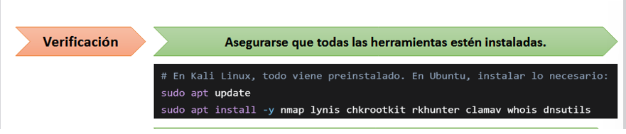
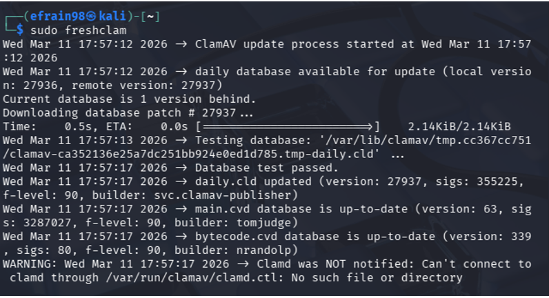
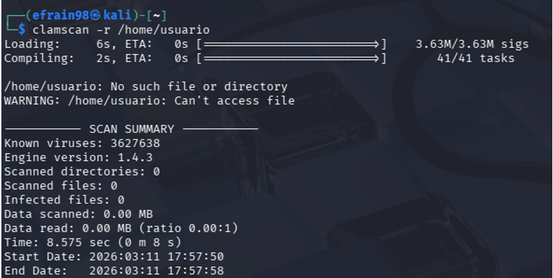
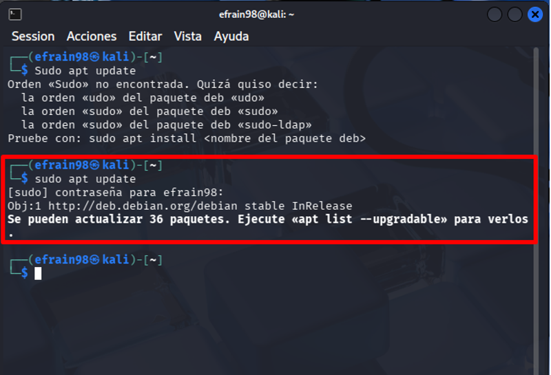
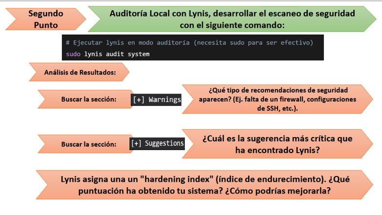
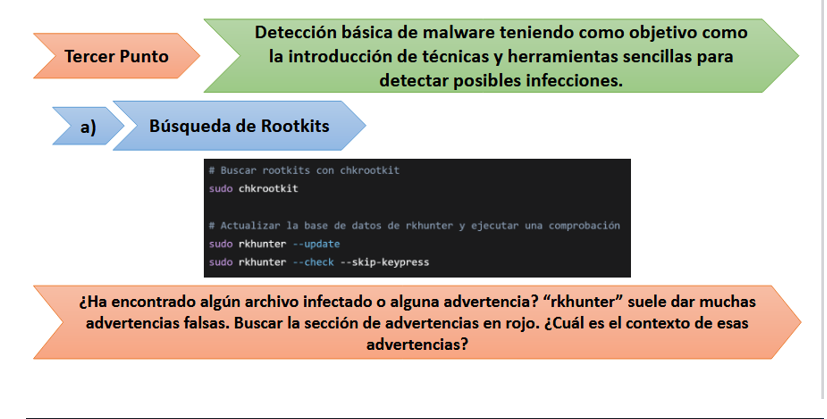
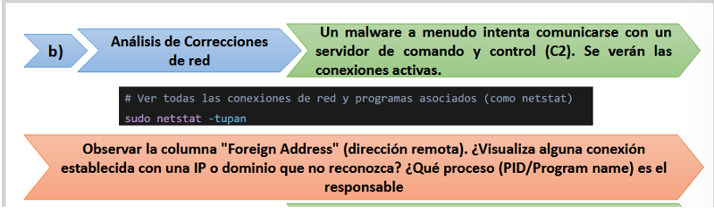
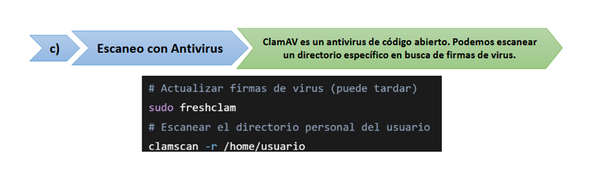

# Seguridad de la información
## Taller 1

# Taller de Seguridad de la Información

Este repositorio documenta el desarrollo completo del **Primer Taller de Seguridad de la Información** realizado en la Fundación Universitaria Compensar. Se aplicaron herramientas de auditoría, escaneo y análisis en Kali Linux, con evidencias visuales y explicaciones detalladas por cada punto.

---

## Verificación de herramientas

Antes de iniciar, se verificó que todas las herramientas estuvieran instaladas correctamente. En Kali Linux vienen preinstaladas, pero se validó su presencia en el sistema.

[Verificación de herramientas](Imagenes/Respuesta_Verificación.png)

---

## Punto 1: Escaneo con Nmap

### a) Descubrimiento de hosts activos
Se identificaron múltiples IPs activas y direcciones MAC, reconociendo fabricantes como Aruba, HP y Dell.

### b) Escaneo de puertos y servicios
Con `nmap -sV 127.0.0.1` se detectaron puertos abiertos y servicios activos.

### c) Scripts NSE para vulnerabilidades
Se aplicó `nmap --script vuln 127.0.0.1` para detectar vulnerabilidades comunes.

### d) Timing templates
Se compararon escaneos con `-T0` y `-T4`.

### e) Puertos filtrados
Se escanearon puertos específicos. El estado “filtered” indica bloqueo por firewall.

### f) Captura de banners
Detalles precisos de versiones y configuraciones.

### g) Scripts para servicios web
Se aplicaron scripts como `http-title`, `http-server-header`, `http-methods`.

---

## Punto 2: Auditoría con Lynis

Se ejecutó `sudo lynis audit system` para evaluar la seguridad local.

---

## Conclusión

Este taller permitió aplicar técnicas reales de escaneo, auditoría y detección de amenazas en un entorno Kali Linux.

